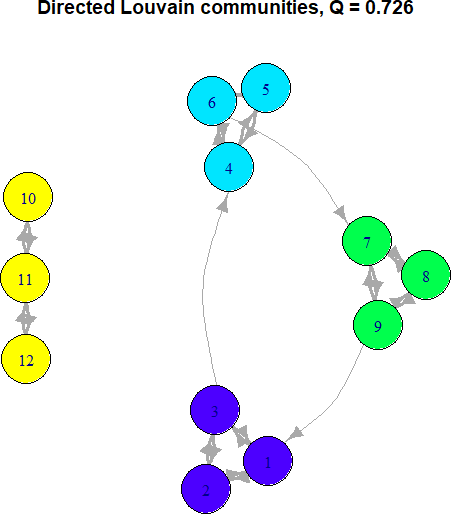

```{r setup, include=FALSE}
knitr::opts_chunk$set(echo = TRUE, eval=FALSE)
```

# **Introduction to the DirectedLouvainR Package (tutorial)**

The **DirectedLouvainR** package is an R package, dedicated in detecting
clusters/partitions in directed graph. This method is opposed to the original
Louvain clustering method, dedicated in undirected graphs,
([Blondel et al., 2024](#ref-blondel2008fast)). This undirected Louvain is
already implemented in **igraph** R package
([Antonov et al., 2022](#ref-antonovl2023fast); Csárdi et al.
[2006](#ref-csardi2006igraph), [2025](#ref-igraph)). **DirectedLouvainR** is
highly relied on the method of Dugué and Perez
([2015](#ref-ref-dugue2015directed), [2022](#ref-dugue2022direction)) and its
supplementary code **DirectedLouvain** in Python and C++, located
[here](https://github.com/nicolasdugue/DirectedLouvain).

## **Example**

In this example we create connections with weight 1 between {1,2,3}, {4,5,6},
{7,8,9}, and {10,11,12}, and some weaker connections with weight 0.2 in {3,4},
{6,7}, and {1,9}.

``` r
# Import packages
library(DirectedLouvainR)
library(igraph)

# Build a graph with 3 communities of different sizes.
# It could be an adjacency matrix or an igraph object instead of this edge list.
el <- data.frame(
  from   = c(1,1,2,2,3,3,  4,4,5,5,6,6,  7,7,8,8,9,9,10,10,11,11,12,12),
  to     = c(2,3,1,3,1,2,  5,6,4,6,4,5,  8,9,7,9,7,8,10,11,10,12,11,12),
  weight = c(1,1,1,1,1,1,  1,1,1,1,1,1,  1,1,1,1,1,1,  1,1,1,1,1,1)
)

# Add weaker inter-community edges
el <- rbind(el,
            data.frame(from=c(3,6,9), to=c(4,7,1), weight=c(0.2,0.2,0.2)))

# Set seed for reproducibility
set.seed(42)

# Find partitions using Directional Louvain
part <- directed_louvain(el, verbose=FALSE)
cat("Partitions:", part, "\n")
```

```
## Partitions: 1 1 1 2 2 2 3 3 3 4 4 4 
```

``` r
# Find directed modularity
Q <- directed_modularity(el, part)
cat("Directed modularity:", Q, "\n")
```

```
## Directed modularity: 0.7255602 
```

``` r
# Plot
g <- graph_from_edgelist(as.matrix(el[,c("from","to")]), directed=TRUE)
E(g)$weight <- el$weight
V(g)$color <- topo.colors(max(part))[part]

plot(g,
     edge.width = E(g)$weight * 3,
     edge.curved = rep(0.3, ecount(g)),
     vertex.size = 25,
     #vertex.label.color = "black",
     vertex.label.cex = 1,
     main = paste("Directed Louvain communities, Q =", round(Q,3))
)
```

<p align="center">
    
</p>
<p class="caption" align="center">
<span id="ref-directedlouvaincommunities"></span>Fig. 1: Directed Louvain
communities.
</p>

As seen in Figure [1](#ref-directedlouvaincommunities), algorithm has detected
the 4 groups of {1,2,3}, {4,5,6}, {7,8,9}, and {10,11,12}. This partitioning has
directed modularity of about 0.726.


## **References**

<span class="nocase" id="ref-antonovl2023fast">
Antonov M., Csárdi G., Horvát S., Müller K., Nepusz T., Noom D., Salmon M.,
Traag V., Welles B. F., Zanini F. (2023). igraph enables fast and robust
network analysis across programming languages.
<em>arXiv preprint arXiv:2311.10260</em>.
[https://doi.org/10.48550/arXiv.2311.10260](https://doi.org/10.48550/arXiv.2311.10260)

<span class="nocase" id="ref-blondel2008fast">
Blondel, V. D., Guillaume, J. L., Lambiotte, R., & Lefebvre, E. (2008). Fast
unfolding of communities in large networks.
<em>Journal of statistical mechanics: theory and experiment</em>, 2008(10),
P10008.
[https://doi.org/10.1088/1742-5468/2008/10/P10008](https://doi.org/10.1088/1742-5468/2008/10/P10008)

<span class="nocase" id="ref-csardi2006igraph">The igraph
Csárdi G, Nepusz T (2006). “The igraph software package for complex network
research.” <em>InterJournal</em>, *Complex Systems*, 1695.
[https://igraph.org](https://igraph.org)

<span class="nocase" id="ref-igraph"></span>
Csárdi, Gábor, Tamás Nepusz, Vincent Traag, Szabolcs Horvát, Fabio
Zanini, Daniel Noom, and Kirill Müller. 2025.
igraph: Network Analysis and Visualization in R.
[https://doi.org/10.5281/zenodo.7682609](https://doi.org/10.5281/zenodo.7682609)

<span class="nocase" id="ref-dugue2015directed"></span>
Dugué, N., & Perez, A. (2015). Directed Louvain: maximizing modularity in
directed networks (Doctoral dissertation, Université d'Orléans).

<span class="nocase" id="ref-dugue2022direction"></span>
Dugué, N., & Perez, A. (2022). Direction matters in complex networks: A
theoretical and applied study for greedy modularity optimization. \emph{Physica
A: Statistical Mechanics and its Applications}, 603, 127798.
[https://doi.org/10.1016/j.physa.2022.127798](https://doi.org/10.1016/j.physa.2022.127798)
